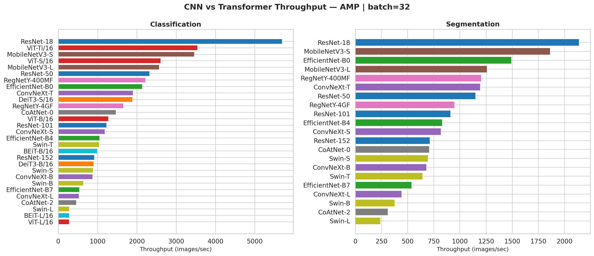

# ThroughputBencher

A simple deep learning model throughput benchmarking tool with geospatial machine learning applications in mind.

When choosing a model backbone for large-scale inference — mapping a country from satellite imagery, processing daily sensor feeds, running disaster response pipelines — throughput (images/sec) is often as important as accuracy. Yet most papers and benchmarks focus on accuracy alone, and practitioners are left guessing how fast a model will actually run on their hardware.

ThroughputBencher measures end-to-end inference throughput for **29 model architectures** across CNNs, Vision Transformers, and hybrids, on both classification and segmentation tasks. It tests precision modes (fp32, fp16, bf16, AMP), `torch.compile`, and automatically finds the optimal batch size for your GPU. Results are saved as a CSV for easy analysis, and a [3D globe visualization](webapp/index.html) lets you see what these throughput numbers mean in terms of real-world coverage.

[](LICENSE)

## Quick Start

```bash
# Clone and set up
git clone https://github.com/calebrob6/throughput-bencher.git
cd throughput-bencher
make setup       # conda env, or: pip install -r requirements.txt

# Run the benchmark (uses GPU 0 by default)
make benchmark

# Generate charts
make visualize
```

## Key Findings

*TODO: Results will be populated after running benchmarks on clean hardware.*

<!-- Uncomment when results are available:


-->

## Pixels/sec → Square Kilometers

Converting throughput to real-world coverage requires knowing the **Ground Sample Distance (GSD)** — the physical size of one pixel.

```
area_per_patch = (224 × GSD)² / 10⁶  km²
coverage_rate  = throughput × area_per_patch  km²/s
```

| Sensor | GSD | Area per 224×224 Patch | @ 1,000 img/s | @ 5,000 img/s |
|--------|-----|----------------------|---------------|---------------|
| High-res commercial | 0.3 m | 0.0045 km² | 4.5 km²/s | 22.6 km²/s |
| NAIP / aerial | 1 m | 0.050 km² | 50 km²/s | 251 km²/s |
| Sentinel-2 (10m) | 10 m | 5.02 km² | 5,017 km²/s | 25,088 km²/s |
| Sentinel-2 (20m) | 20 m | 20.07 km² | 20,070 km²/s | 100,352 km²/s |
| Landsat (30m) | 30 m | 45.16 km² | 45,158 km²/s | 225,792 km²/s |

**Assumptions:**
- End-to-end throughput (includes DataLoader + CPU→GPU transfer + model forward pass)
- No overlap between patches (in practice, sliding windows may overlap 50%+)
- Single GPU / single machine
- Batch inference at the largest power-of-2 batch size that fits
- 3-channel RGB input at 224×224 pixels

## Models Benchmarked

| Family | Models | Type | Segmentation |
|--------|--------|------|:------------:|
| ResNet | ResNet-18, 50, 101, 152 | CNN | ✅ |
| EfficientNet | B0, B4, B7 | CNN | ✅ |
| ConvNeXt | Tiny, Small, Base, Large | CNN | ✅ |
| MobileNetV3 | Small, Large | CNN | ✅ |
| RegNetY | 400MF, 4GF | CNN | ✅ |
| ViT | Ti/16, S/16, B/16, L/16 | ViT | ❌* |
| DeiT3 | S/16, B/16 | ViT | ❌* |
| Swin | Tiny, Small, Base, Large | ViT | ✅ |
| BEiT | B/16, L/16 | ViT | ✅ |
| CoAtNet | 0, 2 | Hybrid | ✅ |

*All models use [SMP DPT](https://github.com/qubvel-org/segmentation_models.pytorch) (Dense Prediction Transformer) as the segmentation decoder, which handles both hierarchical (CNN, Swin) and non-hierarchical (ViT, DeiT, BEiT) backbones.*

## Globe Race 🏁

Open [`webapp/index.html`](webapp/index.html) in a browser for a 3D globe visualization where two models "race" to map the Earth. Select any two models, pick a GSD, and watch the coverage sweep across the globe at speeds proportional to their throughput.

> "EfficientNet-B0 finished mapping Earth while ViT-L/16 is still in Africa"

## Benchmarking Methodology

- **GPU isolation**: Benchmark aborts if other processes are detected on the GPU (override with `--force`)
- **Auto batch size**: Finds the largest power-of-2 batch size that fits, validated with 3 forward passes per candidate to account for cudnn autotuner memory
- **Warmup**: 20 iterations discarded before timing (handles torch.compile JIT)
- **Timing**: Wall-clock (`time.perf_counter`) with `torch.cuda.synchronize()` at boundaries — measures end-to-end throughput including data transfer
- **Duration**: Each config runs for at least 30 seconds
- **Throughput**: `total_images / wall_clock_time`
- **Memory**: Peak GPU memory reset after warmup; reports steady-state inference memory
- **Cleanup**: `torch.cuda.empty_cache()` + `gc.collect()` + sleep between models
- **Data**: Random 3×224×224 tensors via DataLoader (`num_workers=8`, `prefetch_factor=2`, `pin_memory=True`). Use `--input-channels` and `--input-size` to customize (default: 3×224×224).
- **Segmentation**: SMP DPT (Dense Prediction Transformer) decoder with timm encoders, 10 output classes, no pretrained weights. DPT supports all backbone types (CNN, ViT, hybrid) for fair cross-architecture comparison.

### Precision Modes

- **fp32**: Standard 32-bit floating point. On Ampere+ GPUs (A100, H100, etc.), `torch.set_float32_matmul_precision("high")` enables **TF32 tensor cores** for matmuls, so "fp32" actually uses TF32 precision (10-bit mantissa instead of 23-bit). This matches what virtually all modern "fp32" benchmarks measure. The CSV includes a `tf32_enabled` column to disambiguate.
- **fp16**: Full model conversion to float16.
- **bf16**: Available on Ampere+ GPUs (compute capability ≥ 8.0). Automatically skipped on older GPUs that lack hardware support.
- **AMP**: PyTorch automatic mixed precision (`torch.autocast`).

### Compiled Benchmarks

`torch.compile` can significantly accelerate inference. Use `make benchmark-compiled` to run with both `default` and `max-autotune` compile modes, or pass `--compile-modes` directly:

```bash
python benchmark.py --gpu-id 0 --compile-modes default max-autotune
```

Results include `compiled` and `compile_mode` columns in the CSV.

### DataLoader vs Pre-allocated Batches

By default, benchmarks pre-allocate a batch directly on GPU and measure pure compute throughput. Pass `--dataloader` to feed data through a PyTorch DataLoader instead — more realistic for production, but adds overhead.

We profiled each step of the pipeline for a single batch (512×3×224×224 on V100):

| Step | Time |
|------|------|
| `torch.ones` on CPU (per worker) | 10 ms |
| `torch.randn` on CPU (per worker) | 506 ms |
| CPU → GPU transfer (pinned, async) | ~0 ms |
| **DataLoader IPC** (8 workers → main process) | **~143 ms** |
| `torch.randn` directly on GPU | 1.8 ms |
| **ResNet-18 forward pass** | **232 ms** |

The DataLoader bottleneck is **IPC overhead** — moving 293 MB of tensor data from worker processes to the main process through shared memory. Even with `torch.ones` (10ms to create vs 506ms for `torch.randn`), the DataLoader still takes ~144ms per batch because serialization and shared memory transfer dominate.

This means the default (pre-allocated) path measures **peak GPU compute throughput** (the upper bound), while `--dataloader` measures **end-to-end pipeline throughput** (realistic for production). For ResNet-18 at batch 512:

| Mode | Throughput |
|------|-----------|
| Pre-allocated GPU batch (default) | ~4,600 img/s |
| DataLoader (`--dataloader`, `num_workers=8`) | ~2,000 img/s |

Both are reported honestly — choose the metric that matches your use case.

## Reproducing

```bash
# Full benchmark on GPU 0 (auto batch size, all models, ~2 hours)
make benchmark

# Use a specific GPU
make benchmark GPU_ID=2

# Quick test (4 models, 10s per config)
make benchmark-quick

# Run with torch.compile (default + max-autotune modes)
make benchmark-compiled

# Custom run
python benchmark.py --gpu-id 0 --models resnet50 vit_base_patch16_224

# Manual batch size sweep
python benchmark.py --gpu-id 0 --batch-sizes 1 8 32 64

# Custom input configuration (e.g., 4-channel 128×128 images)
python benchmark.py --gpu-id 0 --input-channels 4 --input-size 128

# Generate charts from all CSVs in results/
make visualize
```

## Sanity Check Script

`benchmark_sanity_check.py` is a minimal standalone benchmark for ResNet-18 that serves as a reference implementation. Use it to verify that `benchmark.py` produces consistent results on your hardware.

```bash
# Run with DataLoader (default)
python benchmark_sanity_check.py --device 0 --runtime-seconds 30

# Run with pre-allocated GPU batch
python benchmark_sanity_check.py --device 0 --runtime-seconds 30 --no-dataloader
```

It uses `torch.inference_mode()`, wall-clock timing with `torch.cuda.synchronize()` at boundaries, and shows live throughput via tqdm. The numbers should closely match `benchmark.py` for ResNet-18 at the same batch size and mode. If they diverge significantly, something is off with your environment.

## Contributing Results

We welcome benchmark results from different hardware! Running on an A100, H100, or other GPU? Here's how to contribute:

```bash
# 1. Run the benchmark
make benchmark

# 2. This generates:
#    results/{gpu_slug}.csv              — benchmark results
#    results/{gpu_slug}_hardware.json    — hardware metadata

# 3. Open a PR
git checkout -b results/my-gpu-name
git add results/
git commit -m "Add benchmark results for <your GPU>"
git push origin results/my-gpu-name
```

The GPU slug is auto-detected (e.g., `tesla_v100_sxm2_32gb`, `nvidia_a100_sxm4_80gb`).

**PR checklist:**
- [ ] GPU was idle during benchmarking (the script enforces this)
- [ ] Used default settings (`make benchmark`)
- [ ] Hardware JSON shows correct GPU info

## CSV Output Columns

Each row in the output CSV represents one benchmark configuration. Key columns:

| Column | Description |
|--------|-------------|
| `model_name` | timm model identifier |
| `display_name` | Human-readable model name |
| `model_family`, `model_type` | Architecture family and type (cnn/vit/hybrid) |
| `task` | `classification` or `segmentation` |
| `precision` | `fp32`, `fp16`, `bf16`, or `amp` |
| `compiled`, `compile_mode` | Whether `torch.compile` was used and which mode |
| `gpu_name`, `gpu_mem_gb` | GPU hardware info |
| `batch_size` | Batch size used |
| `throughput_mean` | Mean throughput (images/sec) |
| `pixels_per_sec` | Throughput in pixels/sec |
| `latency_mean_ms` | Mean per-batch latency (ms) |
| `latency_p50_ms` | Median (p50) per-batch latency (ms) |
| `latency_p95_ms` | 95th percentile per-batch latency (ms) |
| `latency_p99_ms` | 99th percentile per-batch latency (ms) |
| `params_M` | Model parameters (millions) |
| `macs_G` | Multiply-accumulate operations (billions) |
| `peak_memory_mb` | Peak GPU memory during inference (MB) |
| `tf32_enabled` | Whether TF32 tensor cores were active for fp32 matmuls |
| `input_channels` | Number of input channels (default: 3) |
| `input_size` | Spatial input resolution (default: 224) |
| `pytorch_version`, `cuda_version` | Software versions |
| `timestamp` | When the benchmark was run |

## Adding Custom Models

Add entries to `models.py`:

```python
ModelConfig(
    timm_name="your_model_name",      # must exist in timm.list_models()
    display_name="Your Model",
    family="YourFamily",
    arch_type="cnn",                  # "cnn", "vit", or "hybrid"
    color="#hex_color",
    supports_segmentation=True,       # False if non-hierarchical (plain ViTs)
)
```

For geo-FM backbones: if your model is available through timm (or a timm-compatible registry), it can be added directly. Otherwise, extend `create_model_for_task()` in `benchmark.py`.

## Citation

```bibtex
@software{throughput-bencher2026,
  title={ThroughputBencher: Geospatial Model Throughput Benchmark},
  author={Robinson, Caleb},
  year={2026},
  url={https://github.com/calebrob6/throughput-bencher},
  license={MIT}
}
```

## License

[MIT](LICENSE)