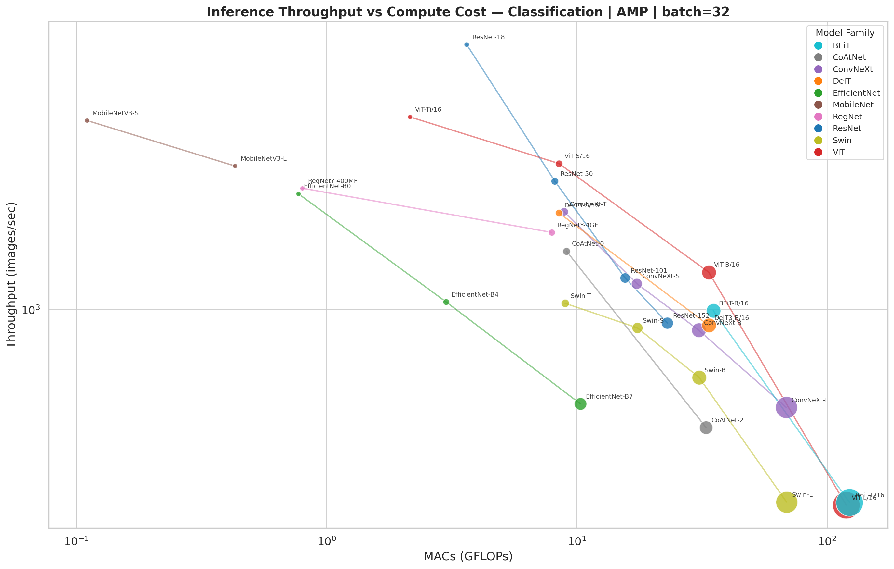

# 🌍 GeoSpeedy

**How fast can your model map the Earth?**

A rigorous inference throughput benchmark for geospatial ML model backbones — comparing CNNs, Vision Transformers, and hybrids on patch classification and segmentation tasks.

> Most geospatial foundation models use ViT-L backbones. But how much throughput are we leaving on the table? GeoSpeedy measures it.

[](LICENSE)

---

## Motivation

The geospatial ML community has converged on Vision Transformer (ViT) architectures — especially ViT-L — as the default backbone for foundation models (Prithvi, SatMAE, Clay, Scale-MAE, etc.). While ViTs excel at representation learning, their inference throughput is significantly lower than CNNs of comparable accuracy. For operational deployment — mapping entire countries, running disaster response pipelines, or processing daily satellite feeds — **throughput matters**.

This benchmark provides the data to make informed architecture choices by measuring:
- **~30 model architectures** across CNN, ViT, and hybrid families
- **Classification and segmentation** (SMP U-Net) tasks
- **Precision modes**: fp32, fp16, AMP
- **torch.compile** effects
- **GPU and CPU** performance at varying thread counts
- **Batch size scaling** behavior

Plus a fun [**3D Globe Race**](webapp/index.html) visualization where two models race to map the Earth.

## Key Findings

*Results from 8× Tesla V100-SXM2-32GB, PyTorch 2.7.1, timm 1.0.25, 1,200 benchmark configurations*

- **CNNs dominate throughput**: MobileNetV3-S achieves **21,732 img/s** — **61× faster** than ViT-L/16 (354 img/s) for classification
- **At Sentinel-2 10m GSD**, MobileNetV3-S covers **109,000 km²/s** vs ViT-L at **1,777 km²/s** — that's the entire contiguous US in ~70 seconds vs ~75 minutes
- **AMP provides 1.3-3.8× speedup** across architectures on V100, with transformers benefiting most (DeiT3-B: 3.78×, ViT-S: 3.53×)
- **torch.compile** gives modest gains (1.1-1.5×) on V100; expected to be larger on A100/H100
- **Swin Transformers** are the fastest hierarchical ViT variant but still 3-6× slower than lightweight CNNs
- **Zero OOMs** across all 29 models, 4 batch sizes, 3 precisions, and 2 compile modes on V100-32GB
- **For segmentation** (SMP U-Net), MobileNetV3-S (3,461 img/s) is **11× faster** than Swin-L (307 img/s)

## Results

The full benchmark results are in [`results/benchmark_results.csv`](results/benchmark_results.csv).

### Throughput vs Compute Cost

Each bubble is a model. Size = parameter count. Color = model family. Lines connect models within the same family.



### CNN vs Transformer Comparison


## Pixels/sec → Square Kilometers

Converting throughput to real-world coverage requires knowing the **Ground Sample Distance (GSD)** — the physical size of one pixel.

```
area_per_patch = (224 × GSD)² / 10⁶  km²
coverage_rate  = throughput × area_per_patch  km²/s
```

| Sensor | GSD | Area per 224×224 Patch | @ 1,000 img/s | @ 5,000 img/s |
|--------|-----|----------------------|---------------|---------------|
| High-res commercial | 0.3 m | 0.0045 km² | 4.5 km²/s | 22.6 km²/s |
| NAIP / aerial | 1 m | 0.050 km² | 50 km²/s | 251 km²/s |
| Sentinel-2 (10m) | 10 m | 5.02 km² | 5,017 km²/s | 25,088 km²/s |
| Sentinel-2 (20m) | 20 m | 20.07 km² | 20,070 km²/s | 100,352 km²/s |
| Landsat (30m) | 30 m | 45.16 km² | 45,158 km²/s | 225,792 km²/s |

**Assumptions:**
- Pure compute throughput — no disk I/O, network transfer, or pre/post-processing
- No overlap between patches (in practice, sliding windows may overlap 50%+)
- Single GPU / single machine
- Batch inference (not one-at-a-time)
- 3-channel RGB input at 224×224 pixels

## Models Benchmarked

| Family | Models | Type | Segmentation |
|--------|--------|------|:------------:|
| ResNet | ResNet-18, 50, 101, 152 | CNN | ✅ |
| EfficientNet | B0, B4, B7 | CNN | ✅ |
| ConvNeXt | Tiny, Small, Base, Large | CNN | ✅ |
| MobileNetV3 | Small, Large | CNN | ✅ |
| RegNetY | 400MF, 4GF | CNN | ✅ |
| ViT | Ti/16, S/16, B/16, L/16 | ViT | ❌* |
| DeiT3 | S/16, B/16 | ViT | ❌* |
| Swin | Tiny, Small, Base, Large | ViT | ✅ |
| BEiT | B/16, L/16 | ViT | ❌* |
| CoAtNet | 0, 2 | Hybrid | ✅ |

*\*Plain ViTs produce single-scale features incompatible with U-Net's multi-scale encoder-decoder architecture. Swin Transformers are hierarchical and work natively.*

## Globe Race 🏁

Open [`webapp/index.html`](webapp/index.html) in a browser for a 3D globe visualization where two models "race" to map the Earth. Select any two models, pick a GSD, and watch the coverage sweep across the globe at speeds proportional to their throughput.

> "EfficientNet-B0 finished mapping Earth while ViT-L/16 is still in Africa"

## Benchmarking Methodology

- **GPU isolation**: One benchmark per GPU; GPU verified empty before each run
- **Warmup**: 20 iterations discarded before timing (handles torch.compile JIT)
- **Timing**: `torch.cuda.Event` with `enable_timing=True` for precise GPU kernel timing
- **Duration**: Each config runs for at least 10 seconds to get stable statistics
- **Throughput**: Computed as `total_images / total_time` (aggregate, not mean of per-iteration rates)
- **Memory**: Peak GPU memory reset after warmup; reports steady-state inference memory
- **Cleanup**: `torch.cuda.empty_cache()` + `gc.collect()` + 2s sleep between models
- **Data**: Random 3×224×224 tensors via DataLoader (no disk I/O bottleneck)
- **Segmentation**: SMP U-Net with timm encoders, 10 output classes, no pretrained weights

## Reproducing

```bash
# Install dependencies
pip install -r requirements.txt

# Run GPU benchmark on GPU 0
python benchmark.py --gpu-id 0

# Run specific models only
python benchmark.py --gpu-id 0 --models resnet50 vit_base_patch16_224

# Run CPU benchmark with varying thread counts
python benchmark.py --device cpu --tasks classification --num-threads 1 4 8

# Generate visualization charts
python visualize.py

# Quick test (one model, fast settings)
python benchmark.py --gpu-id 0 --models resnet18 --batch-sizes 32 --warmup 5 --timed-seconds 3
```

## Adding Custom Models

Add entries to `models.py`:

```python
ModelConfig(
    timm_name="your_model_name",      # must exist in timm.list_models()
    display_name="Your Model",
    family="YourFamily",
    arch_type="cnn",                  # "cnn", "vit", or "hybrid"
    color="#hex_color",
    supports_segmentation=True,       # False if non-hierarchical (plain ViTs)
)
```

For geo-FM backbones: if your model is available through timm (or a timm-compatible registry), it can be added directly. Otherwise, extend `create_model_for_task()` in `benchmark.py`.

## Hardware Tested

| Component | Specification |
|-----------|--------------|
| GPU | 8× NVIDIA Tesla V100-SXM2-32GB |
| CPU | 40 cores |
| RAM | 661 GB |
| PyTorch | 2.7.1+cu126 |
| CUDA | 12.6 |
| timm | 1.0.25 |
| SMP | 0.5.0 |

**V100 limitations**: No bf16 support; torch.compile benefits are modest compared to A100/H100 (which have better Tensor Core utilization for compiled graphs). Results on newer hardware would show different patterns.

## Citation

```bibtex
@software{geospeedy2026,
  title={GeoSpeedy: Geospatial Model Throughput Benchmark},
  author={Robinson, Caleb},
  year={2026},
  url={https://github.com/calebrob6/geospeedy},
  license={MIT}
}
```

## License

[MIT](LICENSE)